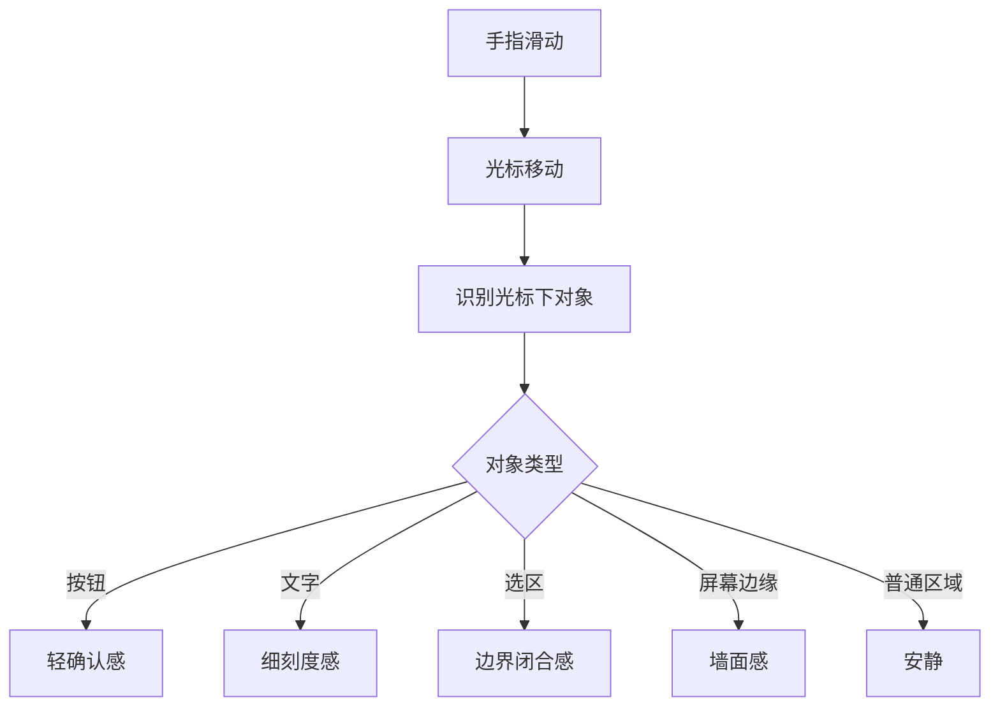

# TouchAble 可触

一个研究型小项目：探索如何在 Mac 触控板上增加“边缘感、刻度感、吸附感、语义感”，让滑动、拖拽、按钮悬停、文字识别和选区变化变得更“摸得到”。

## 当前状态

TouchAble v0.1 本机内测版已经从脚本原型升级为 SwiftPM 原生 macOS 菜单栏 App。

```bash
cd /Users/philrobin/work/touchable
./script/build_and_run.sh
```

验证启动：

```bash
./script/build_and_run.sh --verify
```

直接启动并打开调试面板：

```bash
./script/build_and_run.sh --debug-ui
```

首次本机开发建议先创建稳定的本地签名身份：

```bash
./script/setup_local_signing.sh
```

运行脚本会先在项目内构建 `dist/TouchAble.app`，再复制到固定位置 `~/Applications/TouchAble.app` 并从那里启动。这个固定位置更适合 macOS 隐私授权。

如果系统设置的输入监控或辅助功能列表里没有 TouchAble，运行：

```bash
./script/build_and_run.sh --permissions
```

然后在系统设置里点左下角 `+`，选择 Finder 中显示的 `TouchAble.app`。

运行后会在菜单栏出现 TouchAble 图标。默认不需要辅助功能权限即可体验屏幕边缘触感；授权 Accessibility 后会解锁按钮、链接、文字、输入框等语义触感；授权 Input Monitoring 后会解锁普通 App 中点击、拖拽、滚动的操作触感。

## 当前目标

先做无害、可逆、公开 API 范围内的触觉增强实验。

第一阶段不碰系统底层驱动，不使用私有 API，不做持续高频震动。只用 Apple AppKit 提供的 `NSHapticFeedbackManager` 触发短促的系统级触觉反馈。

## 已有 App 能力

- 菜单栏总开关。
- 边缘触感开关。
- 操作触感开关：点击、拖拽、滚动通过全局 CGEvent tap 触发反馈。
- 光标触感开关：I-beam、手型、拖拽、缩放等光标变化会触发反馈。
- 语义触感开关。
- 轻柔 / 标准 / 明显 三档手感。
- Accessibility 权限状态和授权入口。
- Playground 演示窗口。
- Debug 调试面板：实时显示鼠标位置、当前 AX role、候选触觉、节流判断、最后触发和事件流。
- 调试测试按钮：绕过识别链路，直接测试边缘、按钮、文字、输入框、滑杆触觉。
- 可调触感强度：1-8 档，通过脉冲次数、节奏和混合模式模拟强弱。
- 可开关同一对象重复触发，方便判断“没有感觉”是识别问题还是节流策略。
- 本地 build/run/verify 脚本。

## 已有原型

```bash
cd /Users/philrobin/work/touchable

swift prototypes/haptic-demo.swift ramp
swift prototypes/edge-haptic-demo.swift 60
```

`haptic-demo.swift` 用来体验不同触觉模式。

`edge-haptic-demo.swift` 用光标位置模拟手指滑动，在靠近屏幕边缘或跨越分区时触发反馈。

`semantic-probe.swift` 用 Accessibility 识别光标下面的真实界面对象，只打印不触发触觉。

`semantic-haptic-demo.swift` 是当前最重要原型：它会把按钮、文字、输入框等对象变化映射成触觉反馈。

```bash
swift prototypes/semantic-probe.swift 30
swift prototypes/semantic-haptic-demo.swift 45
```

## 交接入口

下一次继续策划时，优先读：

- [docs/next-session-brief.md](docs/next-session-brief.md)
- [docs/product-brief.md](docs/product-brief.md)
- [docs/raw-discussion.md](docs/raw-discussion.md)
- [TASKS.md](TASKS.md)

## 研究路线：从位置到语义



## 安全边界

- 使用 Apple 公开 AppKit API。
- 只触发短促反馈，不做持续震动。
- 加入节流，避免每秒大量触发。
- 优先做菜单栏开关，随时关闭。
- 不修改系统触控板设置。

## 下一步

1. 做一个“光标语义探测”原型，识别按钮、文字、输入框、选区和普通区域。
2. 把原型改成菜单栏 App。
3. 增加开关、边缘宽度、网格数量、反馈频率设置。
4. 测试多屏幕、不同触控板设备、不同刷新频率下的手感。
5. 评估是否需要辅助功能权限，以及是否值得申请。
6. 记录最舒服的触觉参数。
