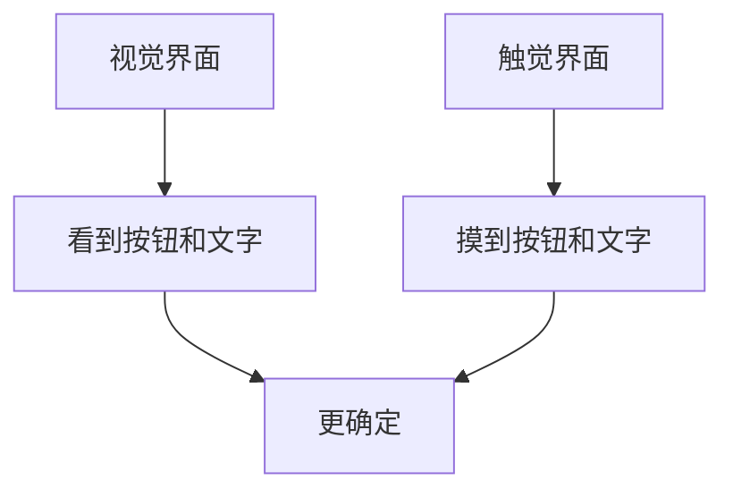
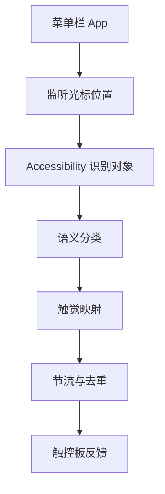

# TouchAble 可触：产品策划入口

## 一句话

TouchAble 可触，是一个让 Mac 界面变得“摸得到”的触觉增强工具。

## 核心体验

当光标滑过按钮、文字、输入框、边缘、选区等不同界面对象时，触控板给出克制、短促、可理解的触觉反馈。

目标不是制造震动，而是让界面有材质、有边界、有回应。

## 产品愿景

Mac 现在主要是视觉界面。

TouchAble 想加上一层很轻的触觉界面：

## 第一性问题

我们要让用户获得什么新感受？

不是“我的触控板会震了”，而是：

- 我知道光标碰到了一个可操作对象。
- 我感觉到文字、输入框、按钮之间的差别。
- 我在拖动、选择、滚动时更有掌控感。
- Mac 变得更像一个有物理质感的工具。

## MVP 建议

第一版应该做成菜单栏 App。

基础能力：

- 总开关。
- 语义触感开关。
- 边缘触感开关。
- 轻柔 / 标准 / 明显 三档手感。
- 权限状态提示。

第一版语义对象：

- 按钮。
- 链接。
- 输入框。
- 静态文字。
- 菜单项。
- 屏幕边缘。

暂缓：

- 复杂手势识别。
- 自定义波形。
- 驱动层控制。
- 过多参数。
- 上架前商业化。

## 产品气质

关键词：

- 安静。
- 克制。
- 原生。
- 灵敏。
- 有质感。

反面：

- 不要像恶作剧软件。
- 不要持续震动。
- 不要满屏提示。
- 不要一开始就做复杂配置。

## 可能用户

### 1. Mac 重度用户

他们每天长时间使用触控板，希望操作更有反馈。

### 2. 设计师和创作者

他们对“手感”“对齐”“吸附”“材质”敏感。

### 3. ADHD / 注意力容易飘的人

触觉反馈可能帮助他们确认操作状态。

### 4. 视力负担较重的人

触觉可能减轻一部分“必须盯着看”的负担。

### 5. 软件体验爱好者

他们会被“Mac 界面可以被摸到”这个概念吸引。

## 技术路线

## 当前已验证事实

- `NSHapticFeedbackManager` 能触发真实触觉。
- 当前机器能感受到反馈。
- `AXUIElementCopyElementAtPosition` 能识别光标下的 UI 对象。
- 语义对象变化可以映射到不同触觉反馈。
- Phil 对语义触觉原型的第一反应非常强烈，认为“惊艳”。

## 最大风险

- Accessibility 权限会让普通用户犹豫。
- 不同 App 的 AX 角色质量不一致。
- 触觉过密会烦。
- Apple 公开 API 的触觉模式有限。
- 无法直接控制真实强度，只能通过节奏和模式模拟强弱。

## 产品判断

值得继续。

原因：

- 原型已经跑通核心体验。
- 体验点新鲜且强。
- 技术路径在公开 API 范围内。
- 可以先做本地工具，不急着上架。

下一阶段应该从“脚本惊艳”走向“可长期打开的安静工具”。
