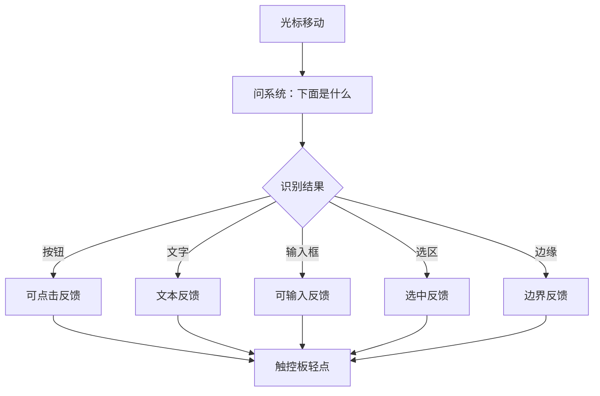

# 语义触感方案

## 核心想法

TouchAble 不只是让触控板震一下，而是让光标碰到不同“语义对象”时，有不同触感。

比如：

- 光标进入按钮：轻轻确认一下。
- 光标进入文字：有更细的、像纸面纹理一样的提示。
- 开始选中文字：给一个“拉住了”的反馈。
- 选区边界变化：给轻微刻度感。
- 滑到屏幕边缘：像碰到墙。

这会让 Mac 从“看见界面”变成“摸到界面”。

## 人话模型

## 三层实现路径

### 第一层：全局位置触感

已经跑通。

能力：

- 屏幕边缘。
- 屏幕网格区域。
- 光标跨区域。

技术：

- `NSEvent.mouseLocation`
- `NSHapticFeedbackManager`

这是最稳定、最低风险的底座。

### 第二层：全局语义触感

目标是识别光标下面是什么控件。

技术：

- `AXUIElementCopyElementAtPosition`
- `AXUIElementCopyAttributeValue`
- macOS Accessibility 权限

可以尝试识别：

- `AXButton`
- `AXLink`
- `AXTextField`
- `AXTextArea`
- `AXStaticText`
- `AXMenuItem`
- `AXSlider`
- `AXCheckBox`

触感建议：

- 按钮、链接：`alignment`
- 文本、输入框：`levelChange`
- 普通区域：不触发
- 角色变化：触发一次
- 同一对象内移动：安静，避免烦

### 第三层：自家 App 内精细触感

如果要做最“好玩”的体验，应该建一个 TouchAble Playground。

里面放几个专门验证手感的场景：

- 按钮矩阵。
- 文字段落。
- 可拖拽卡片。
- 可调滑杆。
- 可选中文本。
- 贴边吸附窗口。

技术：

- SwiftUI / AppKit
- `NSTrackingArea`
- `NSCursor`
- `NSHapticFeedbackManager`

这层可以做到最细，因为我们自己知道每个区域是什么。

## 最好玩的第一版

我建议第一版不要追求全局大而全，而是做两个东西：

1. 菜单栏后台程序：开启后能在真实系统里感受到按钮、链接、输入框、屏幕边缘。
2. Playground 窗口：专门用来体验“可触的界面”，把按钮、文字、选区、滑杆、吸附做得非常明显。

这样一边有实际用途，一边有演示感染力。

## 触觉词典

| 对象 | 触感 | 触发时机 |
| --- | --- | --- |
| 屏幕边缘 | 墙面感 | 第一次进入边缘带 |
| 按钮 | 可点击感 | 光标进入新按钮 |
| 链接 | 轻跳感 | 光标进入链接 |
| 文字 | 纸面感 | 进入文本区域 |
| 输入框 | 可输入感 | 进入输入区域 |
| 滑杆 | 刻度感 | 值跨过刻度 |
| 选区 | 闭合感 | 选区开始、结束、边界变化 |

## 关键原则

触觉反馈必须少而准。

不要让用户觉得“它一直在震”，而是让用户觉得“界面有材质、有边界、有回应”。

## 近期任务

1. 写 `semantic-probe.swift`，在终端里打印光标下对象角色。
2. 加入触觉映射：角色变化时轻触一下。
3. 做权限检测和友好提示。
4. 记录在 Finder、Safari、Chrome、Notion、Obsidian、Terminal 里的表现差异。
5. 再决定是否进入菜单栏 App。
